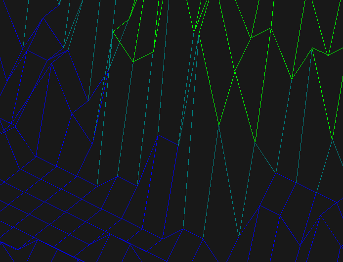
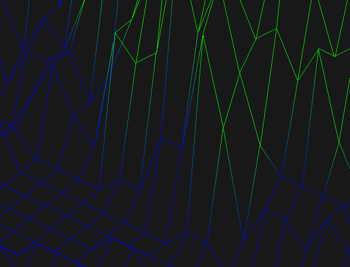

# FDF

FDF is a 3D wireframe representation program built in C using the **MiniLibX** graphics library. It takes a map file (a simple text file containing altitude values) and renders it in an isometric projection. The program supports **antialiasing**, **gradient shading**, **Motion Blur** and other graphical enhancements.

## Features

- **Parallele Projection**: Displays a 3D representation of the terrain.
- **Antialiasing**: Smooths out jagged edges for a cleaner look.
- **Gradient Coloring**: Applies color gradients based on altitude values.
- **Zoom & Rotation**: Allows interactive zooming and rotation.
- **Map Loading** : Allows in app map loading.
- **Draw line on/off** : Allows you to select if you want line drawing or only points drawing.
- **HUD / Buttons** : Quick settings buttons, and show some stuff in the data section.

## Installation

```sh
# Clone the repository
git clone https://github.com/PabloBellissant/fdf.git
cd fdf

# Compile the program
make

# Run FDF with a map file
./fdf maps/42.fdf
```

## Controls

| Key | Action |
| --- | --- |
| right click + move | Rotate map |
| mouse wheel | Zoom In / Out |
| middle click + move | Translate map |
| left click + move | Select zone |
| Arrow Up / Down | Change height |
| Arrow Left / Right | Change map |
| ESC | Exit the program |

## Antialiasing Showcase

Below is an example of the **antialiasing** feature in action (look at the lines in detail):

Without antialiasing



With antialiasing


## Gradient Shading

The program applies **smooth gradient shading** based on altitude values:

Without smooth gradiant shading


With smooth gradiant shading



## Supported Map Format

The FDF program accepts maps in the following format:

```
0  0  0  0  0  0  0  0  0  0
0 10 10 10 10 10 10 10 10  0
0 10 20,0xFF0000 15,0xFF0000 12 15,0xFF0000 17,0xFF0000 20,0xFF0000 10  0
0 10 15,0xFF0000 10 12 15,0xFF0000 15,0xFF0000 15,0xFF0000 10  0
0  5 15,0xFF0000 10 12 15,0xFF0000 15,0xFF0000 13 10  0
0  5 10  5  7 12 12 12 10  0
0  5  7  1  2  7  5  5  7  0
0  3  0  0  1  2  2  2  5  0
0  1  0  0  0  0  0  0  3  0
0  0  0  0  0  0  0  0  0  0
```
Each number represents an altitude value for the corresponding point on the map.
the hex code just after represents the color in RRGGBB


## Dependencies

- **MiniLibX** (included in the repository)
- **Make** (for compilation)

## License

This project is licensed under the MIT License.

## Author

[Pablo Bellissant](https://bellissantpablo.fr)
